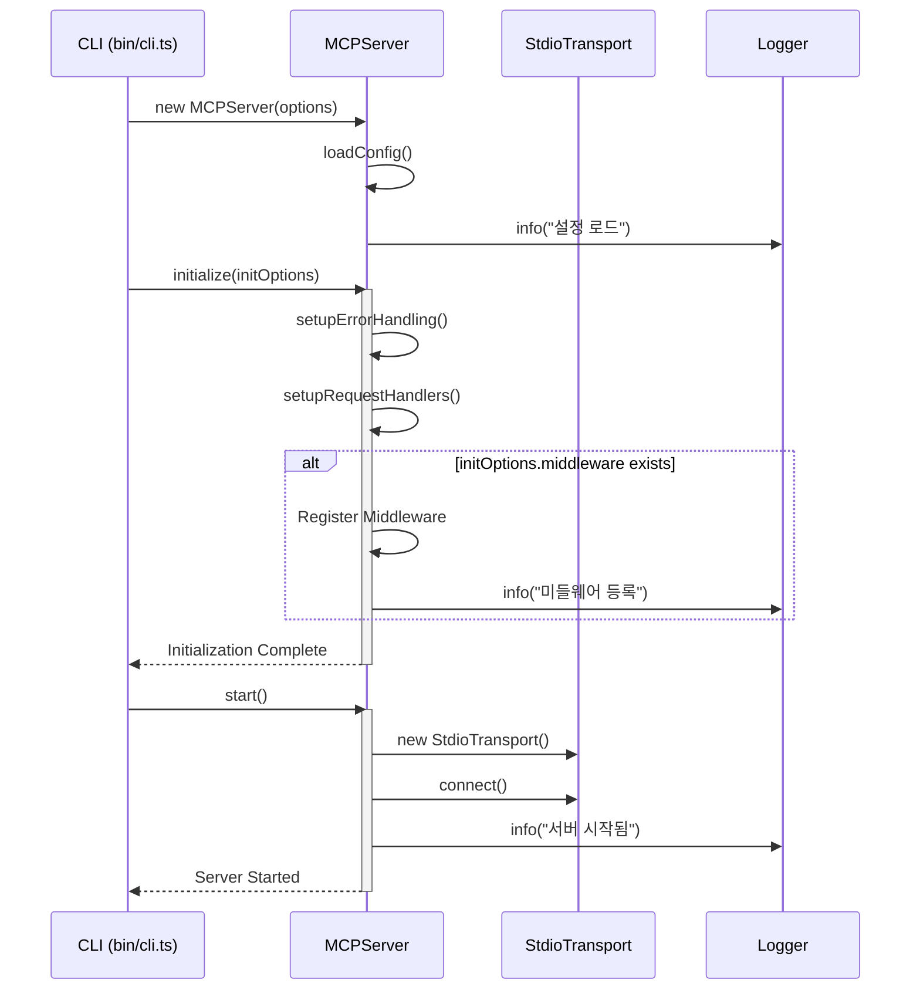

# MCP Server Template

Model Context Protocol(MCP) 서버를 위한 TypeScript 템플릿 프로젝트입니다.

## 빠른 시작

```bash
# npx로 직접 실행
npx @jonsoku2/mcp-template-ts@latest start

# 디버그 모드로 실행
npx @jonsoku2/mcp-template-ts@latest start -d

# 여러 옵션 조합
npx @jonsoku2/mcp-template-ts@latest start -d --no-middleware
```

## 프로젝트로 설치

### npx로 프로젝트 생성

```bash
# 새 프로젝트 생성 (최신 버전)
npx @jonsoku2/mcp-template-ts@latest init my-mcp-server

# 특정 버전으로 프로젝트 생성
npx @jonsoku2/mcp-template-ts@1.0.8 init my-mcp-server

# 옵션과 함께 프로젝트 생성
npx @jonsoku2/mcp-template-ts@latest init my-mcp-server --template typescript --port 4000

# 생성된 프로젝트로 이동
cd my-mcp-server

# 의존성 설치
npm install
```

### 수동 설치

```bash
# 저장소 클론
git clone https://github.com/jonsoku2/mcp-template-ts.git
cd mcp-template-ts

# 의존성 설치
npm install

# TypeScript 컴파일 및 빌드
npm run build
```

## 프로젝트 구조

```
src/
├── bin/
│   └── cli.ts          # CLI 진입점
├── server.ts           # MCP 서버 코어
├── types/
│   └── index.ts        # 타입 정의
├── tools/
│   └── index.ts        # 도구 모음
└── utils/
    └── logger.ts       # 로깅 유틸리티
```

## 주요 기능

- TypeScript 기반 MCP 서버 구현
- 미들웨어 시스템 지원
- Winston 기반 로깅 시스템
- 디버그 모드 지원
- 환경 변수 기반 설정

## CLI 옵션

서버 시작 시 다음 옵션들을 사용할 수 있습니다:

```bash
# 디버그 모드 활성화
npm start -- -d
# 또는
npm start -- --debug

# 미들웨어 비활성화
npm start -- --no-middleware

# 여러 옵션 조합
npm start -- -d --no-middleware
```

## 환경 변수

서버 실행 시 다음 환경 변수들을 사용할 수 있습니다:

```bash
# 기본 설정
export MCP_PORT=3000          # 서버 포트
export MCP_HOST=localhost     # 서버 호스트
export MCP_LOG_LEVEL=info     # 로그 레벨 (debug, info, warn, error)
export MCP_TIMEOUT=5000       # 타임아웃 (ms)
export MCP_MAX_RETRIES=3      # 최대 재시도 횟수
export MCP_API_KEY=           # API 키 (옵션)
```

## 시스템 구조

### 서버 초기화 및 시작 프로세스



## 라이센스

MIT
