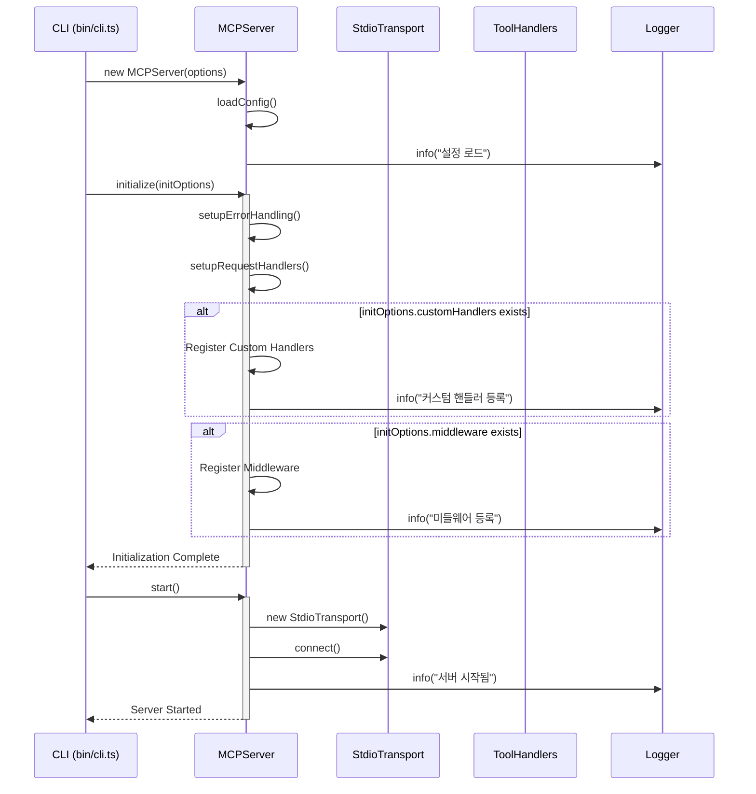
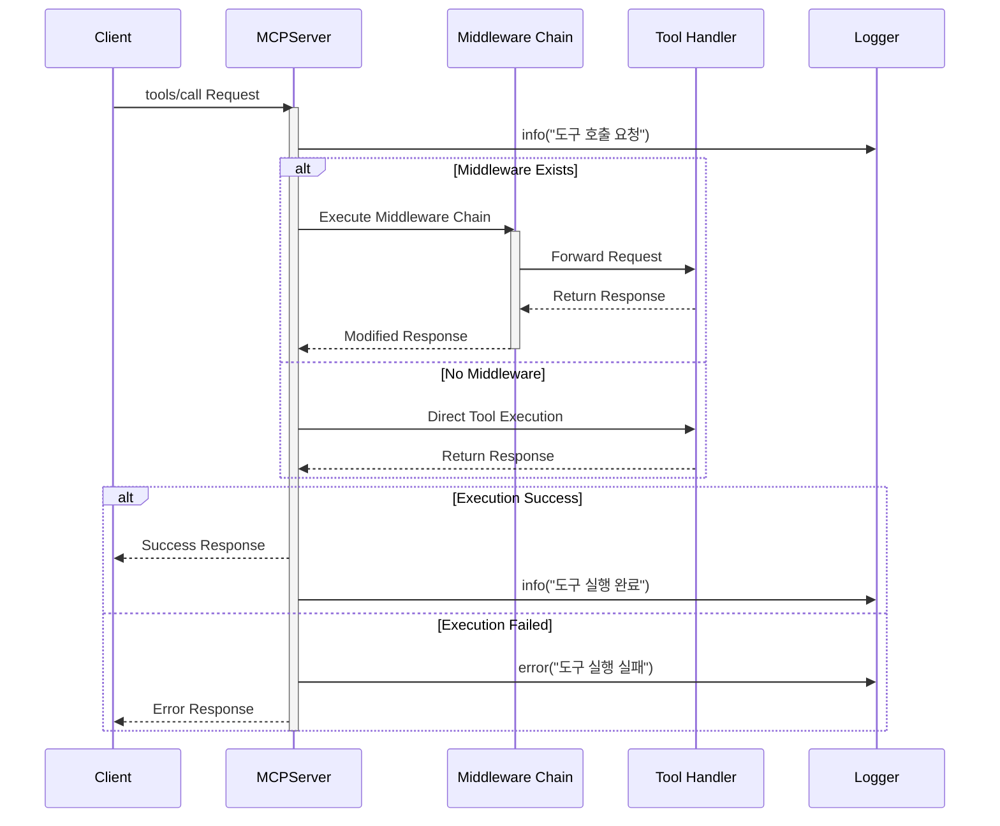
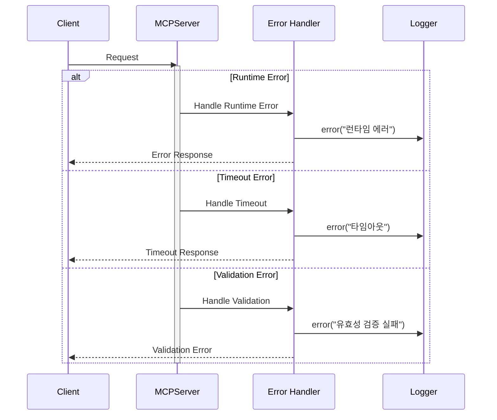
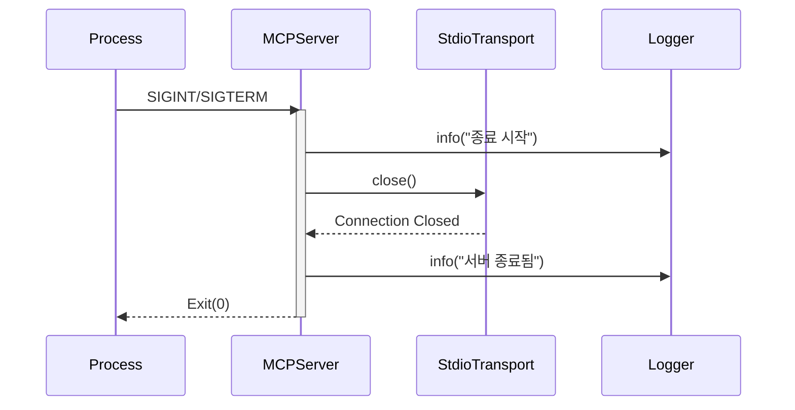

# MCP Server Template

Model Context Protocol(MCP) 서버를 위한 보일러플레이트 프로젝트입니다.

## 빠른 시작

```bash
# npx로 직접 실행 (최신 버전)
npx @jonsoku2/mcp-template-ts@latest start

# 특정 버전으로 실행
npx @jonsoku2/mcp-template-ts@1.0.8 start

# 디버그 모드로 실행
npx @jonsoku2/mcp-template-ts@latest start -d

# 포트 지정하여 실행
npx @jonsoku2/mcp-template-ts@latest start --port 4000

# 여러 옵션 조합
npx @jonsoku2/mcp-template-ts@latest start -d --port 4000 --no-middleware

# 전역 설치 (최신 버전)
npm install -g @jonsoku2/mcp-template-ts@latest

# 전역 설치 후 실행
mcp-template start
```

## 프로젝트로 설치

### npx로 프로젝트 생성

```bash
# 새 프로젝트 생성 (최신 버전)
npx @jonsoku2/mcp-template-ts@latest init my-mcp-server

# 특정 버전으로 프로젝트 생성
npx @jonsoku2/mcp-template-ts@1.0.8 init my-mcp-server

# 옵션과 함께 프로젝트 생성
npx @jonsoku2/mcp-template-ts@latest init my-mcp-server --template typescript --port 4000

# 생성된 프로젝트로 이동
cd my-mcp-server

# 의존성 설치
npm install
```

### 수동 설치

```bash
# 저장소 클론
git clone https://github.com/jonsoku2/mcp-template-ts.git
cd mcp-template-ts

# 의존성 설치
npm install

# TypeScript 컴파일 및 빌드
npm run build
```

## 기능

- MCP 서버 기본 구조 제공
- 도구(Tool) 등록 및 관리 시스템
- Winston 기반 로깅 시스템
- 디버그 모드 지원
- MCP Inspector 통합
- 미들웨어 시스템
- 커스텀 핸들러 지원

## CLI 사용법

### 기본 명령어

```bash
# 개발 모드로 실행 (TypeScript 소스 직접 실행)
npm run dev

# 프로덕션 모드로 실행 (빌드된 JavaScript 실행)
npm start

# 디버그 모드로 실행
npm run debug
# 또는
npm start -- -d

# MCP Inspector로 서버 검사
npm run inspect
# 또는
npm start -- inspect
```

### CLI 옵션

서버 시작 시 다음 옵션들을 사용할 수 있습니다:

```bash
# 디버그 모드 활성화
npm start -- -d
# 또는
npm start -- --debug

# 미들웨어 비활성화
npm start -- --no-middleware

# 커스텀 핸들러 비활성화
npm start -- --no-custom-handlers

# 여러 옵션 조합
npm start -- -d --no-middleware --no-custom-handlers
```

### 빌드된 파일 직접 실행

빌드된 파일을 직접 실행하는 방법입니다:

```bash
# JavaScript로 컴파일
npm run build

# 빌드된 파일 실행
node dist/bin/cli.js start

# 옵션과 함께 실행
node dist/bin/cli.js start -d
node dist/bin/cli.js start --no-middleware
node dist/bin/cli.js inspect

# PM2로 실행 (프로덕션 환경)
pm2 start dist/bin/cli.js -- start
```

### 환경 변수

서버 실행 시 다음 환경 변수들을 사용할 수 있습니다:

```bash
# 기본 설정
export MCP_PORT=3000
export MCP_HOST=localhost
export MCP_LOG_LEVEL=info
export MCP_TIMEOUT=5000
export MCP_MAX_RETRIES=3

# 환경 변수와 함께 실행
MCP_PORT=4000 MCP_LOG_LEVEL=debug npm start
```

## 프로젝트 구조

빌드 후 생성되는 주요 파일들:

```
dist/
├── bin/
│   └── cli.js          # CLI 진입점
├── server.js           # 서버 코어
├── types/
│   └── index.js        # 타입 정의
├── tools/
│   ├── index.js        # 도구 모음
│   └── processData.js  # 예제 도구
├── services/
│   └── exampleService.js
└── utils/
    └── logger.js       # 로깅 유틸리티
```

## Claude Desktop 설정

MacOS와 Windows에서 빌드된 서버를 Claude Desktop과 연동하는 방법입니다:

### MacOS
설정 파일 위치: `~/Library/Application Support/Claude/claude_desktop_config.json`

```json
{
  "mcpServers": {
    "example-mcp": {
      "command": "npx",
      "args": ["@jonsoku2/mcp-template-ts@latest", "start", "--port", "4000", "--no-middleware"],
      "options": {
        "cwd": "/프로젝트/루트/경로"
      }
    }
  }
}
```

### Windows
설정 파일 위치: `%APPDATA%/Claude/claude_desktop_config.json`

```json
{
  "mcpServers": {
    "example-mcp": {
      "command": "npx",
      "args": ["@jonsoku2/mcp-template-ts@latest", "start", "--port", "4000", "--no-middleware"],
      "options": {
        "cwd": "C:\\프로젝트\\루트\\경로"
      }
    }
  }
}
```

## 시스템 시퀀스 다이어그램

### 서버 초기화 및 시작 프로세스



### 도구 실행 프로세스



### 에러 처리 프로세스



### 서버 종료 프로세스



## 개발 환경 설정

### Node.js 버전 관리

이 프로젝트는 Node.js v22.13.1 이상을 요구합니다. nvm을 사용하여 Node.js 버전을 관리할 수 있습니다:

```bash
# nvm 설치 (맥OS/Linux)
curl -o- https://raw.githubusercontent.com/nvm-sh/nvm/v0.39.0/install.sh | bash

# nvm 설치 (Windows)
# https://github.com/coreybutler/nvm-windows/releases 에서 설치

# Node.js v22.13.1 설치
nvm install v22.13.1

# 프로젝트의 Node.js 버전 사용
nvm use

# 기본 버전으로 설정 (선택사항)
nvm alias default v22.13.1
```

### npm 설정

프로젝트는 npm v10.0.0 이상이 필요하며, 다음과 같은 npm 설정을 사용합니다 (.npmrc):

```ini
# 엔진 버전 제한 엄격 적용
engine-strict=true

# 정확한 버전으로 의존성 저장
save-exact=true

# package-lock.json 생성
package-lock=true

# 보안 감사 활성화
audit=true

# 불필요한 기능 비활성화
fund=false
update-notifier=false

# Git 태그 설정
git-tag-version=true
allow-same-version=false

# 릴리즈 커밋 메시지 형식
message="chore(release): %s 🎉"
```

## 릴리즈 프로세스

### 자동 릴리즈

프로젝트는 자동화된 릴리즈 프로세스를 제공합니다:

```bash
# 릴리즈 스크립트 실행
npm run release
```

릴리즈 스크립트는 다음 작업을 수행합니다:

1. 현재 브랜치가 `main`인지 확인
2. 작업 디렉토리가 깨끗한지 확인
3. 릴리즈 타입 선택
   - patch: 버그 수정 (0.0.x)
   - minor: 새로운 기능 (0.x.0)
   - major: 주요 변경 (x.0.0)
   - custom: 직접 버전 입력
4. 버전 업데이트
5. 변경사항 커밋
6. Git 태그 생성
7. 빌드, 테스트, 린트 실행
8. GitHub에 푸시
9. npm에 배포

### 수동 릴리즈

수동으로 릴리즈하려면 다음 단계를 따르세요:

```bash
# 1. 버전 업데이트
npm version patch|minor|major

# 2. 빌드
npm run build

# 3. 테스트
npm run test

# 4. 린트
npm run lint

# 5. GitHub에 푸시
git push origin main
git push origin v1.0.0  # 해당 태그 버전으로 변경

# 6. npm에 배포
npm publish
```

### 릴리즈 전 체크리스트

- [ ] 모든 테스트가 통과하는지 확인
- [ ] 린트 에러가 없는지 확인
- [ ] CHANGELOG.md가 업데이트되었는지 확인
- [ ] README.md가 최신 상태인지 확인
- [ ] 의존성이 최신 버전인지 확인
- [ ] Git 작업 디렉토리가 깨끗한지 확인
- [ ] main 브랜치에 있는지 확인

## 라이센스

MIT
